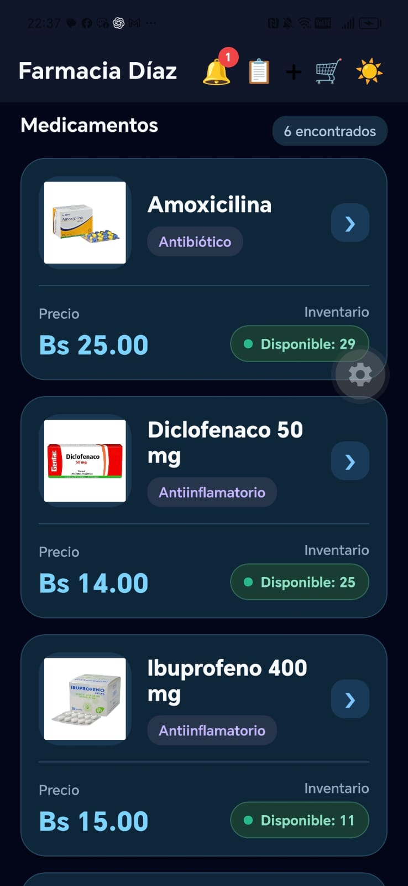

# Farmacia Díaz App

Aplicación móvil desarrollada con React Native, Expo y TypeScript para la gestión de inventario de medicamentos de Farmacia Díaz.

El sistema permite administrar medicamentos, controlar el stock, registrar pedidos, gestionar alertas de vencimiento y mantener un historial de movimientos del inventario.

---

## Funcionalidades principales

- Registro, edición y eliminación de medicamentos.
- Búsqueda y filtrado por categorías.
- Registro de fotografías desde cámara o galería.
- Almacenamiento de imágenes mediante Cloudinary.
- Control de stock de medicamentos.
- Alertas de stock bajo.
- Alertas de medicamentos próximos a vencer.
- Registro y consulta de pedidos.
- Descuento automático de stock al realizar pedidos.
- Historial de movimientos del inventario.
- Modo claro y modo oscuro.

---

## Tecnologías utilizadas

| Tecnología | Uso |
|---|---|
| React Native | Desarrollo de la aplicación móvil |
| Expo | Entorno de desarrollo y ejecución |
| TypeScript | Lenguaje principal |
| Firebase Firestore | Base de datos NoSQL |
| Firebase Authentication | Autenticación |
| Cloudinary | Almacenamiento de imágenes |
| React Navigation | Navegación entre pantallas |
| Git y GitHub | Control de versiones |

---

## Estructura del proyecto

```text
FarmaciaDiazApp/
│
├── assets/
│   └── logo-farmacia.png
│
├── screenshots/
│   ├── inventario-modo-claro.png
│   └── inventario-modo-oscuro.png
│
├── src/
│   ├── components/
│   │   ├── AlertaCampana.tsx
│   │   └── MedicamentoCard.tsx
│   │
│   ├── config/
│   │   └── firebase.ts
│   │
│   ├── screens/
│   │   ├── AlertasScreen.tsx
│   │   ├── DetalleMedicamentoScreen.tsx
│   │   ├── EditarMedicamentoScreen.tsx
│   │   ├── MedicamentosScreen.tsx
│   │   ├── MovimientosScreen.tsx
│   │   ├── PedidosScreen.tsx
│   │   └── RegistrarMedicamentoScreen.tsx
│   │
│   ├── services/
│   │   ├── cloudinaryService.ts
│   │   ├── medicamentosCrudService.ts
│   │   ├── medicamentosService.ts
│   │   ├── movimientosService.ts
│   │   ├── pedidosLecturaService.ts
│   │   └── pedidosService.ts
│   │
│   ├── theme/
│   │   └── colors.ts
│   │
│   └── types/
│       ├── Medicamento.ts
│       └── Pedido.ts
│
├── App.tsx
├── package.json
└── README.md
```

---

## Organización

El proyecto está organizado en componentes, pantallas y servicios para separar la interfaz de usuario de la lógica de acceso a datos.

- `components`: componentes reutilizables de la aplicación.
- `screens`: pantallas principales.
- `services`: operaciones con Firebase, pedidos, movimientos e imágenes.
- `config`: configuración de Firebase.
- `types`: modelos utilizados con TypeScript.
- `theme`: configuración visual de la aplicación.

---

## Capturas de pantalla

### Modo claro


### Modo oscuro



---

## Flujo principal

```text
Inventario
    ↓
Detalle del medicamento
    ↓
Registro del pedido
    ↓
Actualización del stock
    ↓
Registro del movimiento
```

El registro de pedidos utiliza una transacción de Firestore para actualizar el stock y registrar el movimiento correspondiente.

---

## Instalación y ejecución

Instalar las dependencias:

```bash
npm install
```

Iniciar el proyecto:

```bash
npx expo start
```

La aplicación puede ejecutarse mediante Expo Go o un emulador Android.

---

## Seguridad

La aplicación utiliza Firebase Authentication y reglas de seguridad de Firestore para controlar el acceso a los datos.

Los archivos que contienen claves privadas, como `serviceAccount.json`, no deben incluirse en el repositorio.

---

## Autor

Martha Gonzales Chumacero

Proyecto desarrollado para la gestión móvil del inventario de Farmacia Díaz.